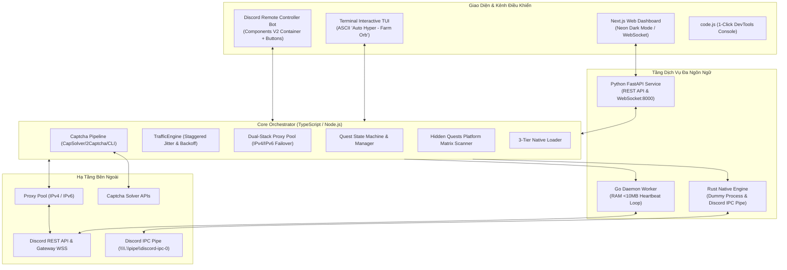

# 🏛️ Bản Đặc Tả Kiến Trúc Kỹ Thuật Toàn Diện: Hyper AutoFarm Quest Polyglot Ecosystem (Master Spec v3.0.0)

- **Ngày ban hành**: 2026-09-24
- **Dự án**: `hyper-autofarmquest-`
- **Phiên bản kiến trúc**: 3.0.0 (Polyglot Monorepo & Discord Components V2)
- **Tác giả / Duyệt**: Antigravity & User

---

## 1. TỔNG QUAN HỆ THỐNG & MỤC TIÊU NÂNG CẤP

Hệ sinh thái `hyper-autofarmquest-` được tái cấu trúc thành một **Polyglot Monorepo** hiện đại, kết hợp sức mạnh tối ưu của nhiều ngôn ngữ lập trình nhằm đạt hiệu năng tối đa, an toàn tuyệt đối và trải nghiệm người dùng hoàn hảo:

1. **TypeScript & Node.js (Core Orchestrator & CLI)**:
   - Đóng vai trò hạt nhân điều phối trung tâm (Hub Orchestrator).
   - Giữ nguyên giao diện dòng lệnh Interactive TUI Terminal với Banner nghệ thuật ASCII `Auto Hyper - Farm Orb`.
   - Quản lý State Machine nhiệm vụ, Dual-Stack Proxy Pool (IPv4/IPv6), Captcha Pipeline (CapSolver/2Captcha) và Scanner nhiệm vụ ẩn đa nền tảng.
2. **Rust Native Engine (`rust-engine/` - Kế thừa & Nâng cấp từ `markterence/discord-quest-completer`)**:
   - Module tạo Dummy Executable siêu nhẹ (Process Sleeper) mô phỏng chính xác tên file thực thi của game Discord Verified.
   - Tích hợp kết nối trực tiếp với Discord IPC Named Pipe (`\\.\pipe\discord-ipc-0` trên Windows, `/tmp/discord-ipc-0` trên Linux) để Discord Desktop tự động ghi nhận hoạt động chơi game mà không cần mở game thật.
3. **Go Worker (`go-worker/`)**:
   - Daemon gửi Heartbeat nền siêu nhẹ, chiếm dụng bộ nhớ RAM cực thấp (< 10MB), tối ưu cho các VPS cấu hình yếu hoặc chạy 24/7.
4. **Python & FastAPI Service (`python-service/`)**:
   - Backend cung cấp REST API (`/api/quests`, `/api/farm`, `/api/claim`, `/api/orbs`) và WebSocket phục vụ giao tiếp 2 chiều thời gian thực.
5. **Next.js Web UI Dashboard (`web-dashboard/`)**:
   - Giao diện người dùng Web phong cách Cyberpunk / Neon Dark Mode, kết nối WebSocket hiển thị trực tiếp danh sách nhiệm vụ, số lượng Orbs tích lũy và nút 1-click Auto Farm.
6. **Discord Remote Controller Bot (Discord Components V2)**:
   - Ứng dụng công nghệ mới nhất **Discord Components V2** (cờ `IS_COMPONENTS_V2 = 1 << 15`).
   - Sử dụng layout cấu trúc `Container` chứa `Section`, `TextDisplay` và `Button` (bấm nút tương tác trực tiếp để Farm / Claim / Check Status).
   - Hỗ trợ cả 3 môi trường điều khiển: Tin nhắn trực tiếp (DM với Admin), Kênh riêng tư trên Server, và Slash Commands.
   - Tích hợp thông tin xác thực Bot:
     - Bot Token: `your_discord_bot_token`
     - Client Secret: `your_discord_client_secret`
     - Application ID: `1552658898937446400`
7. **C++ Native Addon & Dual-Stack Proxy (`native/`)**:
   - TLS Fingerprint JA4 / HTTP/2 settings chuẩn Chromium và raw TCP SOCKS5 tunnel.

---

## 2. KIẾN TRÚC TOÀN CẢNH (SYSTEM ARCHITECTURE DIAGRAM)



---

## 3. ĐẶC TẢ CHI TIẾT TỪNG MODULE KỸ THUẬT

### 3.1. Rust Subsystem (`rust-engine/` - Game Process & IPC Pipe)
- Kế thừa và cải tiến từ `markterence/discord-quest-completer`:
  - **Tạo Dummy Executable**: Đọc danh sách game từ Discord Quests (ví dụ: `valorant.exe`, `genshinimpact.exe`). Tự động biên dịch/nhân bản một tiến trình dummy siêu nhẹ (~200KB) chạy vô hại trong background và thông báo cho hệ điều hành Windows đăng ký PID.
  - **Discord IPC Named Pipe Connector**: Mở kết nối raw Named Pipe `\\.\pipe\discord-ipc-0` (Windows) hoặc domain socket `/tmp/discord-ipc-0` (Unix). Gửi opcode `SET_ACTIVITY` mô phỏng trạng thái playing game với application ID chuẩn xác của nhiệm vụ.

### 3.2. Go Subsystem (`go-worker/` - Ultra-low RAM Daemon)
- Biên dịch thành file binary thực thi độc lập duy nhất (static binary không cần cài Go runtime khi chạy).
- Nhiệm vụ:
  - Tiếp nhận danh sách quest từ Core Orchestrator qua IPC / JSON file.
  - Chạy vòng lặp heartbeat định kỳ mỗi 30s với độ trễ jitter.
  - Tiêu thụ RAM < 10MB, hỗ trợ chạy background service trên Linux systemd hoặc Windows Service.

### 3.3. Python Subsystem (`python-service/` - REST API & WebSocket)
- Nền tảng: Python 3.12, FastAPI, Uvicorn, WebSockets.
- Các REST Endpoints chính:
  - `GET /api/status`: Trả về trạng thái bot, tài khoản đang farm, proxy đang dùng.
  - `GET /api/quests`: Trả về danh sách nhiệm vụ hiện tại, thời gian còn lại, % hoàn thành.
  - `POST /api/farm`: Nhận `{ quest_id: string }` và bắt đầu cày nhiệm vụ chỉ định.
  - `POST /api/claim`: Nhận thưởng toàn bộ nhiệm vụ đã hoàn thành.
  - `GET /api/orbs`: Thống kê tổng số lượng Discord Orbs đã thu hoạch được.
  - `WS /ws/live`: Kênh WebSocket bắn sự kiện thời gian thực (Heartbeat tick, % progress update, captcha challenge, claim success) cho Web Dashboard.

### 3.4. Next.js Web Dashboard (`web-dashboard/`)
- Nền tảng: Next.js (App Router), Vanilla CSS / Tailwind (Modern Cyber Dark Theme), Lucide Icons.
- Tính năng:
  - **Hero Header**: Hiển thị Banner `Auto Hyper - Farm Orb`, trạng thái kết nối WebSocket.
  - **Orbs Collector Counter**: Đồng hồ đếm số Orbs phát sáng neon lấp lánh.
  - **Quest Cards Grid**: Thẻ từng game với thanh tiến độ động, badge trạng thái (`WATCH_VIDEO`, `PLAY_ON_DESKTOP`, `PLAY_ACTIVITY`).
  - **Nút 1-Click Auto Farm & Auto Claim**: Kích hoạt toàn bộ quy trình chỉ bằng 1 thao tác.

### 3.5. Discord Remote Controller Bot (Discord Components V2)
- Áp dụng chuẩn **Components V2** mới nhất của Discord:
  - Thêm cờ `flags: 1 << 15` (`IS_COMPONENTS_V2`) trong mọi message payload.
  - Bố cục tin nhắn:
    - Root: `Container` (hỗ trợ màu accent viền #5865F2).
    - Bên trong `Container`:
      - `Section` chứa `TextDisplay` hiển thị bảng tiến độ, avatar, proxy và số Orbs.
      - `ActionRow` chứa các `Button`:
        - Nút `[⚡ Auto Farm Tất Cả]` (Style: Success / Green).
        - Nút `[🎁 Nhận Quà (Claim)]` (Style: Primary / Blurple).
        - Nút `[🔄 Đổi Proxy]` (Style: Secondary / Gray).
        - Nút `[🔍 Quét Nhiệm Vụ Ẩn]` (Style: Secondary / Gray).
- Tương tác đa kênh:
  - Phản hồi lệnh Slash Commands `/status`, `/farm`, `/claim`, `/proxy`.
  - Phản hồi trực tiếp khi Admin nhắn tin riêng (Direct Message - DM).
  - Phản hồi trong kênh điều khiển riêng tư trên Server Discord.

### 3.6. Cấu Hình Biến Môi Trường Mở Rộng (`.env`)
```env
# Discord User Token (Dùng để cày Quest)
TOKEN=your_discord_user_token

# Discord Remote Bot Credentials
DISCORD_BOT_TOKEN=your_discord_bot_token
DISCORD_CLIENT_SECRET=your_discord_client_secret
DISCORD_BOT_ID=1552658898937446400
ADMIN_USER_ID=

# Proxy Pool (IPv4 / IPv6)
PROXIES=http://user:pass@ip:port,socks5://ip:port

# Captcha Solver API Keys
CAPSOLVER_API_KEY=
TWOCAPTCHA_API_KEY=

# Port cấu hình Web & Services
PYTHON_PORT=8000
NEXT_PUBLIC_API_URL=http://localhost:8000
PORT=3000
```

---

## 4. KẾ HOẠCH TRIỂN KHAI POLYGLOT THEO TỪNG GIAI ĐOẠN

1. **Giai đoạn 1: Nâng cấp Discord Bot với Discord Components V2**
   - Viết payload builder cho Components V2 (`Container`, `Section`, `TextDisplay`, `Button`).
   - Tích hợp bot credentials sẵn có vào bot controller.
2. **Giai đoạn 2: Xây dựng Rust Sleeper Engine (`rust-engine/`)**
   - Tạo crate Rust hỗ trợ tạo dummy process và kết nối Discord IPC Named Pipe.
3. **Giai đoạn 3: Xây dựng Go Worker Daemon (`go-worker/`)**
   - Viết Go runner siêu nhẹ phục vụ gửi heartbeat định kỳ.
4. **Giai đoạn 4: Xây dựng Python FastAPI Service (`python-service/`)**
   - Tạo REST endpoints và WebSocket live broadcaster.
5. **Giai đoạn 5: Xây dựng Next.js Web Dashboard (`web-dashboard/`)**
   - Tạo giao diện Cyberpunk Neon Dark Mode, kết nối API và WebSocket.
6. **Giai đoạn 6: Docker Compose & Kiểm Thử Toàn Diện**
   - Viết `docker-compose.yml` để khởi chạy toàn bộ 5 dịch vụ đồng thời.
   - Kiểm thử toàn diện và đẩy toàn bộ lên kho Git.
